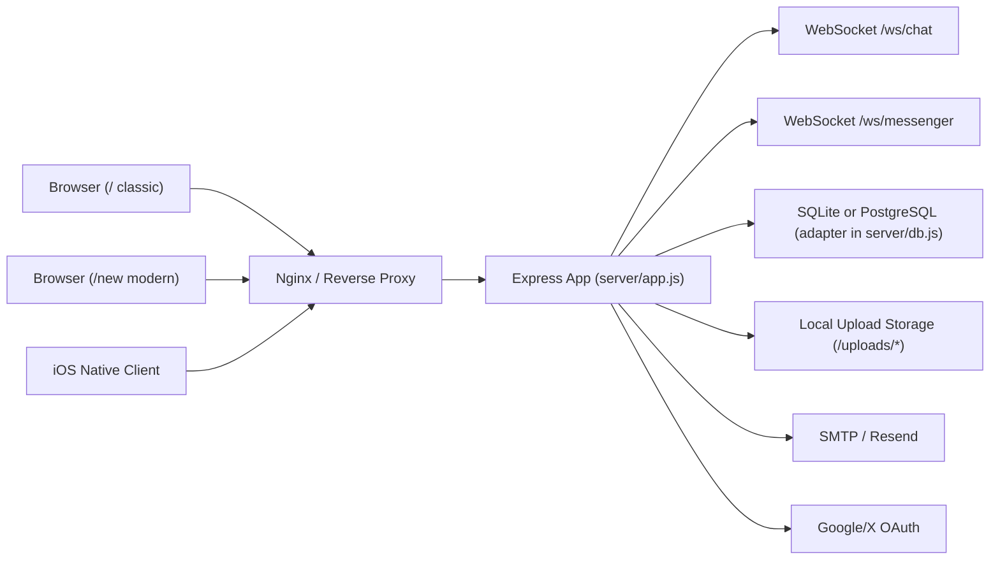
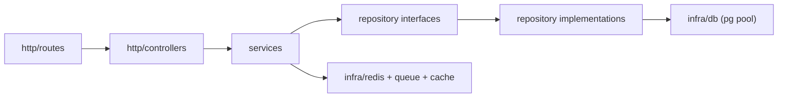

# SDAL Architecture (Phase 0 Baseline)

This document captures the current architecture of the repository and defines the target production architecture for the modernization program.

## Scope and Baseline

- Active web frontends:
  - Classic SPA: `frontend-classic` served from `/`
  - Modern SPA: `frontend-modern` served from `/new`
- Active backend:
  - Single Express app in `server/app.js` (266 routes)
  - WebSockets on `/ws/chat` and `/ws/messenger`
- Active DB runtime:
  - SQLite primary (`db/sdal.sqlite`)
  - PostgreSQL compatibility path exists but is not production-grade
- Full machine-generated inventory:
  - [INVENTORY.md](/Users/cagataydonmez/Desktop/SDAL/docs/INVENTORY.md)

## Current Architecture Map

## Current Module Layout

- Backend entrypoints:
  - `server/index.js` (server start + ws attach)
  - `server/app.js` (all middleware, schema bootstrap, business logic, routes)
  - `server/db.js` (SQLite + PostgreSQL adapter)
- Backend supporting modules:
  - Middleware: `server/middleware/*`
  - Media pipeline: `server/media/*`
  - Scripts: `server/scripts/*`
- Frontend applications:
  - `frontend-modern/src/*`
  - `frontend-classic/src/*`

## Current Inventory Summary

Detailed list is in [INVENTORY.md](/Users/cagataydonmez/Desktop/SDAL/docs/INVENTORY.md). Snapshot:

- Frontend routes:
  - Modern: 36 routes in `frontend-modern/src/App.jsx`
  - Classic: 41 routes in `frontend-classic/src/App.jsx`
- Backend surface:
  - 266 total Express handlers
  - Route families include `/api/*`, `/api/new/*`, `/api/admin/*`, `/api/new/admin/*`, and legacy ASP compatibility routes
- WebSockets:
  - `/ws/chat`, `/ws/messenger`
  - Event types: `chat:new|updated|deleted`, `messenger:hello|new|delivered|read`
- Scheduled/background behaviors:
  - Engagement recalculation startup + interval jobs
  - Periodic in-memory limiter cleanup
  - Delayed engagement recompute scheduling
- Database schema:
  - 15 legacy SQLite tables in file
  - 40 runtime-managed tables created/migrated by app bootstrap logic
- Environment variables:
  - Full list in inventory (`process.env` references from backend/frontend scripts)

## Current Pain Points

1. Backend is monolithic:
   - `server/app.js` contains routing, schema management, auth, business logic, DB orchestration, and websocket logic in one file.
2. Runtime schema mutation in app startup:
   - `CREATE TABLE` + `ALTER TABLE` + `CREATE INDEX` is coupled to server boot, making deploy riskier and non-deterministic.
3. PostgreSQL path is not production-safe:
   - `server/db.js` currently shells out to `psql` command execution rather than using pooled DB connections.
4. Session storage is in-memory:
   - `express-session` default store is used, which is not multi-instance ready and can lose sessions on process restart.
5. Realtime channels are single-instance oriented:
   - No Redis pub/sub fanout; chat websocket auth for `/ws/chat` is payload-based and not session-bound.
6. Legacy/modern naming mix:
   - DB tables/columns and code identifiers are mixed between legacy Turkish-style names and modern names, increasing maintenance cost.
7. Compatibility and behavior duplication:
   - Many endpoint aliases and legacy fallbacks increase complexity and test burden.
8. Admin DB tooling is SQLite-biased:
   - Some introspection endpoints query `sqlite_master` directly and need DB-agnostic abstraction.
9. Limited critical-flow automated coverage:
   - Existing tests are smoke-script style; no comprehensive contract and regression suite for key product flows.

## Target Architecture

## Layered Backend Structure

Target server layout under `server/src`:

- `domain/`
  - Domain entities and value objects (User, Post, Story, Conversation, etc.)
- `repositories/`
  - DB access interfaces + concrete adapters
- `services/`
  - Use-case orchestration, validation, authorization checks
- `http/controllers/`
  - Request/response glue, DTO adapters, compatibility mappings
- `http/routes/`
  - Route registration and middleware wiring
- `infra/`
  - DB pool, Redis clients, queue workers, logging, metrics

## Dependency Direction

## Data Architecture Target

- PostgreSQL as primary production DB using explicit migration files (`server/migrations/*`)
- Redis as shared infra:
  - Session store
  - Cache
  - Rate limiting
  - Pub/sub fanout for websocket events
  - Job queue backend (BullMQ)
- Legacy SQLite retained only for one-time migration input and rollback snapshot workflows

## Compatibility Strategy

- Preserve external routes and current client payload contracts for:
  - Classic web
  - Modern web
  - iOS native client contracts in repo
- Introduce internal modern domain model and schema naming.
- Use compatibility mappers at controller/DTO boundary until optional API versioning.

## Non-Functional Targets

- Reliability:
  - deterministic startup, migration-first schema lifecycle, resilient mail + queue retries
- Performance:
  - pooled DB access, pagination standardization, N+1 elimination, cache for hot paths
- Scalability:
  - single droplet now; multi-instance readiness via Redis-backed state and pub/sub
- Operability:
  - health checks, structured logs with request IDs, slow query visibility, clear deployment runbooks

## Files Produced in Phase 0

- Full inventory: [INVENTORY.md](/Users/cagataydonmez/Desktop/SDAL/docs/INVENTORY.md)
- Rename plan: [RENAME_PLAN.md](/Users/cagataydonmez/Desktop/SDAL/docs/RENAME_PLAN.md)

## Phase 1 Progress (Implemented)

- Added modular backend scaffold under `server/src`:
  - `domain/entities.js`
  - `repositories/interfaces.js` + `repositories/legacy/*`
  - `services/*`
  - `http/controllers/*`
  - `http/dto/legacyApiMappers.js`
  - `bootstrap/createPhase1DomainLayer.js`
- Refactored selected high-traffic routes in `server/app.js` to controller/service/repository flow while keeping endpoint paths and response contracts:
  - `/api/auth/login`
  - `/api/auth/logout`
  - `/api/new/feed`
  - `/api/new/posts`
  - `/api/new/posts/:id/like`
  - `/api/new/posts/:id/comments` (GET/POST)
  - `/api/new/chat/messages` (GET)
  - `/api/new/chat/send`
  - `/api/new/chat/messages/:id` (PATCH)
  - `/api/new/chat/messages/:id/edit`
  - `/api/new/chat/messages/:id` (DELETE)
  - `/api/new/chat/messages/:id/delete`
  - `/admin/users/:id/role`
- Added Phase 1 contract smoke suite:
  - `server/tests/contracts/phase1-contracts.mjs`
  - `server/tests/fixtures/phase1-contract-snapshot.json`

## Phase 2 Progress (Implemented)

- Added PostgreSQL pool infrastructure:
  - `server/src/infra/postgresPool.js` (`pg` Pool singleton, health check, transaction helper, pool state metrics)
- Added Redis infrastructure:
  - `server/src/infra/redisClient.js` (singleton client, reconnect/backoff, ping health check, runtime state)
- Updated session storage wiring:
  - `server/middleware/session.js` now uses Redis-backed `connect-redis` store when `REDIS_URL` is set, with safe fallback behavior.
- Expanded health checks:
  - Added `/health` alias and upgraded `/api/health` to return DB + Redis readiness, latency, runtime state, timestamp, version, and uptime while preserving legacy keys (`ok`, `dbPath`).
- Added local infrastructure compose file:
  - `docker-compose.yml` with PostgreSQL 16 + Redis 7 and health checks.
- Expanded environment template:
  - `server/.env.example` now includes `DATABASE_URL`, Redis settings, pool tunables, `MAIL_*` aliases, `STORAGE_*` aliases, and OAuth variables.

## Phase 3 Progress (Implemented)

- Added numbered migration system:
  - `server/migrations/001_modern_schema.up.sql`
  - `server/migrations/001_modern_schema.down.sql`
  - `server/scripts/migrate.mjs` with `up`, `down`, `status` commands using `schema_migrations`.
- Added modern PostgreSQL schema with:
  - modern table naming (`users`, `post_reactions`, `conversation_members`, etc.),
  - foreign keys and constraints,
  - module-specific indexes for feed/comments/stories/chat/notifications/search-critical paths.
- Added one-time SQLite -> modern PostgreSQL migration tool:
  - `server/scripts/migrate-legacy-sqlite-to-modern-postgres.mjs`
  - deterministic ID preservation where possible,
  - row-count parity checks and FK integrity checks,
  - report output to `migration_report.json`.
- Added migration operational runbook:
  - `docs/MIGRATION.md` with backup, execute, validate, cutover, and rollback steps.
