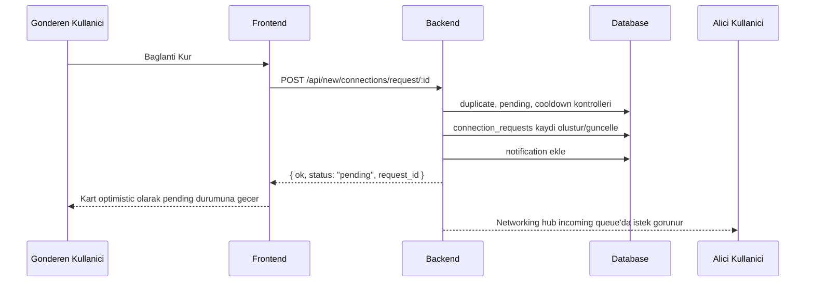
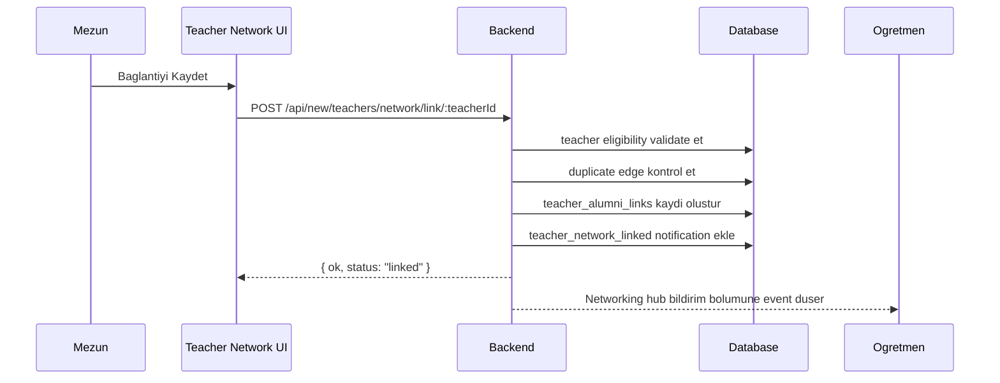
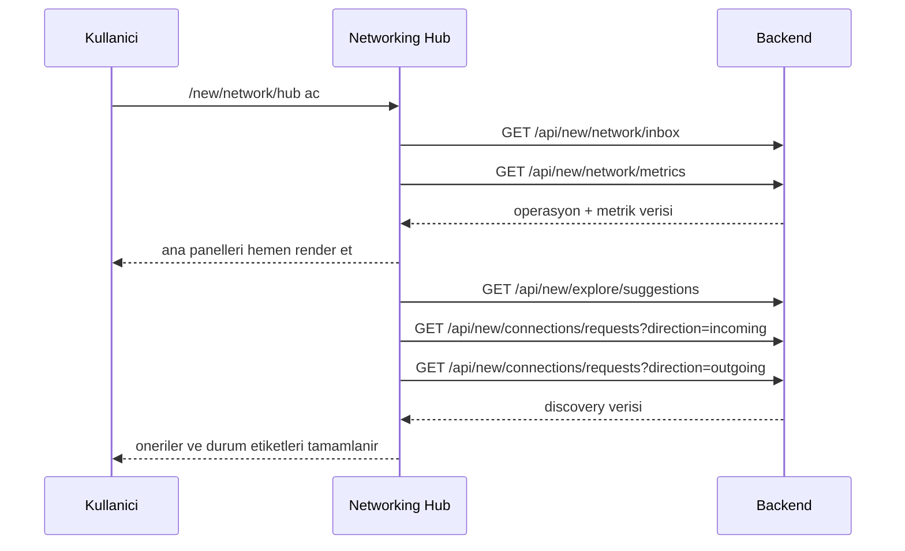

# SDAL Networking Hub & Teacher Network Playbook

Bu doküman, SDAL modern istemcisindeki iki kritik networking modülünü en küçük detayına kadar açıklamak için hazırlanmıştır:

1. `Sosyal Ağ Merkezi` (`/new/network/hub` ve alias olarak `/new/network/inbox`)
2. `Öğretmen Ağı` (`/new/network/teachers`)

Amaç sadece ekranların ne yaptığını anlatmak değildir. Aynı zamanda:

- bu modüllerin neden var olduğunu,
- hangi kullanıcı problemini çözdüğünü,
- frontend ve backend tarafında hangi veri akışlarına dayandığını,
- hangi kurallarla çalıştığını,
- hangi durumda neyin başarı ya da hata sayıldığını,
- bugün ne kadar değer ürettiğini,
- hangi yönlerden geliştirilebileceğini

tek bir yerde açıklamaktır.

---

## 1. Kısa Özet

Bu iki modül birlikte düşünüldüğünde SDAL'ın "sadece profil listesi olan bir mezun sitesi" olmaktan çıkıp "ilişki kuran, ilişki yöneten ve ilişkiden anlam üreten" bir platforma dönüşmesini sağlar.

### 1.1 Sosyal Ağ Merkezi ne işe yarar?

Sosyal Ağ Merkezi, kullanıcının networking ile ilgili tüm bekleyen ve anlamlı hareketlerini tek ekranda toplayan operasyonal bir merkezdir.

Bu merkezde kullanıcı:

- gelen bağlantı isteklerini görür,
- giden bağlantı isteklerini izler,
- gelen mentorluk taleplerini yönetir,
- giden mentorluk taleplerini takip eder,
- öğretmen ağı bildirimlerini okur,
- kendisi için önerilen yeni kişi kartlarını görür,
- kendi networking sağlığını metrikler üzerinden ölçer.

Kısacası bu ekran "networking işi oldu mu, tıkandı mı, kim bekliyor, kimi tanımam gerekiyor?" sorularının operasyon panelidir.

### 1.2 Öğretmen Ağı ne işe yarar?

Öğretmen Ağı, mezunların geçmiş öğretmen ilişkilerini doğrulayabildiği ve sisteme kayıtlı bir sosyal graph edge'e dönüştürebildiği modüldür.

Bu modül sayesinde kullanıcı:

- bir öğretmeni "benim öğretmenimdi" bağlamında sisteme bağlayabilir,
- ilişki türünü seçebilir,
- isterse sınıf yılını girer,
- not ekleyebilir,
- kendi öğretmen geçmişini ya da bir öğretmen hesabının öğrencilerini görebilir.

Bu modül tarihsel okul bağını görünür hale getirir. Bu sadece nostaljik değil, güven üretici bir özelliktir. Çünkü mezun-öğretmen ilişkisi platformdaki `trust graph` katmanının bir parçası haline gelir.

---

## 2. Ürün Perspektifinden Neden Değerli?

Bu bölüm özellikle "bu neden yapıldı?" sorusuna cevap verir.

### 2.1 Normal sosyal ağlardan farkı

SDAL burada genel amaçlı bir sosyal ağ kopyalamıyor. Buradaki graph rastgele insanları bağlayan bir sosyal graph değil; okul tarihi, mezuniyet yılı, mentorluk ve öğretmenlik ekseninde şekillenen bir güven graph'ı.

Bu nedenle bu modüllerin değeri:

- yalnızca iletişim sağlamak değil,
- okul bağlamını dijital olarak ifade etmek,
- o bağı güven sinyaline çevirmek,
- daha kaliteli öneriler üretmek,
- toplulukta kim kimdir sorusunu daha doğru cevaplamak,
- profesyonel networking'i okul geçmişi ile desteklemek

olarak okunmalıdır.

### 2.2 Kullanıcıya kattığı somut fayda

#### Mezun için

- kimden bağlantı isteği geldiğini kaçırmaz,
- kimlerle tanışması gerektiğini daha net görür,
- mentorluk taleplerini tek yerden yönetir,
- öğretmenlerini sisteme bağlayarak profilini daha güvenilir hale getirir,
- öğretmen-ağ bağlantıları sayesinde görünmeyen okul bağları görünür olur.

#### Öğretmen için

- hangi mezunların kendisini sisteme bağladığını görebilir,
- kendi etrafında oluşan alumni graph'ını hisseder,
- potansiyel mentorluk ve görünürlük kazanır.

#### Platform için

- trust badge sistemi beslenir,
- suggestion engine daha zengin sinyalle çalışır,
- admin tarafında moderasyon ve analitik yapılabilir,
- zamanla organik, doğrulanabilir, okul-merkezli bir network graph oluşur.

---

## 3. Temel Kavramlar ve Sözlük

Bu modülleri anlamak için kullanılan terimlerin sabitlenmesi gerekir.

### 3.1 Connection

İki kullanıcı arasındaki çift taraflı networking ilişkisine giden başlangıç akışıdır.

Akış:

1. Kullanıcı A, Kullanıcı B'ye bağlantı isteği yollar.
2. İstek `pending` olur.
3. Kullanıcı B kabul ederse iki taraf arasında karşılıklı `follow` kaydı oluşur.

### 3.2 Follow

Platformdaki en temel yönlü sosyal ilişki.

Bağlantı kabul edilince iki yönlü follow yaratılır:

- `A -> B`
- `B -> A`

Bu nedenle accepted connection, sisteme "karşılıklı follow" olarak yansır.

### 3.3 Mentorship Request

Bir mezunun bir mentor kullanıcıya mentorluk talebi göndermesi.

Bağımsız bir ilişki türüdür; bağlantıdan farklıdır.

### 3.4 Teacher Link

Bir mezunun bir öğretmeni kendisiyle tarihsel bağ içinde ilişkilendirmesi.

Bu doğrudan "bağlantı" ya da "follow" değildir. Bu, `teacher_alumni_links` tablosunda saklanan anlamlı, doğrulanabilir bir graph edge'dir.

### 3.5 Networking Inbox

Bağlantı, mentorluk ve öğretmen ağı bildirimlerinin birleştirildiği operasyon görünümü.

### 3.6 Trust Badge

Kullanıcının profiline güven ve bağlamsal itibar sinyali ekleyen küçük ama etkili rozetler.

Bu modülle ilgili olan rozet:

- `teacher_network`

---

## 4. Roller ve Önkoşullar

Bu modüller herkese aynı şekilde açık değildir.

### 4.1 Giriş şartı

Her iki sayfa da authenticated route altındadır.

- `App.jsx` içinde `RequireAuth` ile korunur.
- Kullanıcı login değilse `/new/login` sayfasına düşer.

### 4.2 Profil tamamlama şartı

Kullanıcı `incomplete` durumdaysa bazı ekranlara zorunlu profile completion akışı uygulanır.

Dolayısıyla networking modülleri aslında dolaylı olarak profile-complete ve auth durumundan etkilenir.

### 4.3 Verification şartı

Network üreten aksiyonların çoğunda `ensureVerifiedSocialHubMember` guard'ı vardır.

Bu şu demektir:

- doğrulanmamış kullanıcı connection request atamaz,
- doğrulanmamış kullanıcı mentorship request atamaz,
- doğrulanmamış kullanıcı teacher link oluşturamaz.

Bu karar çok önemlidir; çünkü sistem "graph üretmeyi" güven ilişkisine bağlamıştır.

### 4.4 Teacher target şartı

Öğretmen Ağı'na eklenebilecek hedef hesaplar herkese açık değildir.

Bir hesabın teacher target olarak kabul edilmesi için backend tarafında şu mantık uygulanır:

- `role = teacher`
- veya `mezuniyetyili` öğretmen cohort'ı ile normalize olur
- veya admin/root seviyesinde rol taşır

Bu nedenle frontend'de görünen CTA tek başına karar mercii değildir; asıl karar backend validation'dadır.

---

## 5. Bilgi Mimarisi ve Ekran Yerleşimi

### 5.1 Route yapısı

İlgili route'lar:

- `/new/network/hub`
- `/new/network/inbox`
- `/new/network/teachers`

`/new/network/inbox` ile `/new/network/hub` aynı React sayfasına düşer. Bu, eski "inbox" terimi ile yeni "hub" teriminin aynı operasyon ekranında birleştiğini gösterir.

### 5.2 Global navigasyondaki yeri

Modern layout içinde iki ayrı menü öğesi vardır:

- `Sosyal Ağ Merkezi`
- `Öğretmen Ağı`

Bu ayrım bilinçlidir.

Çünkü:

- Hub operasyon ekranıdır.
- Teacher Network ise graph oluşturma ve graph inceleme ekranıdır.

Yani biri "işleyen kuyruklar", diğeri "ilişki modeli" ekranıdır.

### 5.3 Bu iki ekran arasındaki ilişki

#### Teacher Network -> Networking Hub etkisi

Bir mezun, öğretmen bağlantısı eklediğinde:

- ilgili öğretmene notification gider,
- bu notification networking hub içindeki `teacher link notifications` bölümüne düşer.

Yani Teacher Network, Networking Hub'ı besleyen bir event üretir.

#### Explore/Profile -> Teacher Network etkisi

Kullanıcı profil sayfasında uygun bir öğretmen hesabı görürse:

- `Öğretmen Ağına Ekle` CTA'sı ile `/new/network/teachers?teacherId=:id` deep-link oluşturulur,
- Teacher Network formu bu öğretmeni ön seçimli açar.

Bu da Teacher Network ekranının birincil giriş yolunun "profil keşfi" olduğunu gösterir.

---

## 6. Veri Modeli

Bu modülleri anlamanın en doğru yolu hangi tabloların nasıl ilişkilendiğini bilmektir.

### 6.1 `connection_requests`

Amaç:

- bağlantı kurma niyetini ve durumunu saklamak

Önemli alanlar:

- `sender_id`
- `receiver_id`
- `status`
- `created_at`
- `updated_at`
- `responded_at`

Status akışı:

- `pending`
- `accepted`
- `ignored`
- `cancelled`

Kullanım:

- request atma
- pending listeleri çıkarma
- accept/ignore/cancel işlemleri
- networking hub incoming/outgoing queue
- metrik hesapları

### 6.2 `follows`

Amaç:

- yönlü sosyal bağı saklamak

Connection kabul edilince iki yönlü kayıt oluşur.

Bu çok kritik bir tasarım kararıdır. Çünkü connection ile follow ayrıdır:

- request süreci `connection_requests` tablosundadır,
- kabul edilmiş sosyal bağ `follows` tablosuna yazılır.

### 6.3 `mentorship_requests`

Amaç:

- mentorluk niyetini ve sonucunu saklamak

Önemli alanlar:

- `requester_id`
- `mentor_id`
- `status`
- `focus_area`
- `message`
- `created_at`
- `responded_at`

Status akışı:

- `requested`
- `accepted`
- `declined`

### 6.4 `teacher_alumni_links`

Amaç:

- mezun ile öğretmen arasındaki tarihsel/sosyal bağı saklamak

Önemli alanlar:

- `teacher_user_id`
- `alumni_user_id`
- `relationship_type`
- `class_year`
- `notes`
- `confidence_score`
- `created_by`
- `created_at`

`relationship_type` allowed values:

- `taught_in_class`
- `mentor`
- `advisor`

Bu tablonun `follow` ile karıştırılmaması gerekir. Bu doğrudan "takipleşme" değil, tarihsel ilişkidir.

### 6.5 `notifications`

Teacher Network ile ilgili event burada `teacher_network_linked` tipi ile tutulur.

Bu event daha sonra networking hub içinde gösterilir.

### 6.6 `uyeler`

Trust badge, verification ve teacher eligibility için kaynak kullanıcı tablosudur.

Bu modüllerin karar verdiği kritik alanlar:

- `role`
- `verified`
- `verification_status`
- `mentor_opt_in`
- `mezuniyetyili`
- `kadi`, `isim`, `soyisim`, `resim`

---

## 7. Sosyal Ağ Merkezi: Kullanıcı Kılavuzu

Bu bölüm son kullanıcı gözüyle ekranın tüm parçalarını anlatır.

### 7.1 Ekranın temel amacı

Sosyal Ağ Merkezi kullanıcının "bekleyen networking işleri" ekranıdır.

Bu ekranı şu sorular için açarsın:

- Beni kim eklemek istiyor?
- Ben kimi bekletiyorum?
- Mentorluk tarafında sıra var mı?
- Öğretmen ağı tarafında yeni bir sinyal var mı?
- Bu hafta ağ kurma performansım nasıl?
- Sistem bana kimi tanışmam için öneriyor?

### 7.2 Ekran bölümleri

#### A. Hero alanı

Bu alan ürün anlatısı ve hızlı CTA alanıdır.

Gösterilenler:

- ağın genel durumu için kısa anlatı,
- kritik sayaçlar,
- keşif, öğretmen ağı ve mesajlara hızlı geçiş.

Bu bölüm kullanıcının sayfaya indiğinde "burası neyin merkezi?" sorusunu cevaplar.

#### B. Health Snapshot / Metrics

Gösterilen dört ana metrik:

- bağlantılar,
- bekleyen istekler,
- mentorluk,
- öğretmen ağı üretimi.

Bu metrikler `7d`, `30d`, `90d` pencereleri arasında değiştirilebilir.

#### C. Gelen Bağlantı İstekleri

Burada kullanıcının kendisine gelen `pending` connection request'leri görünür.

Aksiyonlar:

- `Bağlantıyı Kabul Et`
- `Yoksay`

Bu alan doğrudan operasyon alanıdır. Kullanıcı burada hızlı karar verir.

#### D. Gelen Mentorluk Talepleri

Burada mentor olan kullanıcıların aldıkları `requested` mentorluk talepleri listelenir.

Aksiyonlar:

- kabul et,
- reddet.

Ek bağlam:

- `focus_area`
- request yaşı (stale hint)

#### E. Öğretmen Ağı Bildirimleri

Burada `teacher_network_linked` notification tipindeki event'ler görünür.

Bu bölüm şunu söyler:

"Bir mezun seni öğretmen graph'ına ekledi."

Kullanıcı açısından değeri:

- platformdaki tarihsel bağların farkına varır,
- teacher graph üzerinden görünürlük kazanır.

#### F. Gönderdiğin Bağlantı İstekleri

Kullanıcının başlattığı ama karşı taraftan henüz yanıt almamış connection request'ler.

Bu bölüm bekleyen outbound queue’dur.

#### G. Gönderdiğin Mentorluk Talepleri

Mentorluk sürecinde "bekleyen" outgoing durumu izlemek içindir.

#### H. Önerilen Bağlantılar

Burada Explore suggestion engine’den gelen kısa liste gösterilir.

Her kart kullanıcıya neden önerildiğini açıklayan bir `reason` sinyali taşır.

Aksiyonlar:

- `Bağlantı Kur`
- `Talebi Geri Çek`
- `Bağlantıyı Kabul Et`
- `Takip Et` / `Takibi Bırak`

### 7.3 Ekranın yüklenme davranışı

Yakın dönemde sayfa şu şekilde optimize edilmiştir:

1. Önce kritik operasyon verisi yüklenir:
   - inbox
   - metrics
2. Keşif/suggestion katmanı sonradan gelir:
   - suggestion cards
   - incoming/outgoing request maps

Bu kararın sebebi:

- kullanıcı önce bekleyen işleri görsün,
- keşif katmanı sayfayı bloklamasın,
- layout zıplaması azaltılsın.

### 7.4 Kullanıcı senaryoları

#### Senaryo 1: Biri bana connection request gönderdi

1. Karşı taraf `Bağlantı Kur` aksiyonunu tetikler.
2. Sistem `connection_requests` içine `pending` kayıt açar.
3. Kullanıcı A'nın Hub ekranında `Gelen Bağlantı İstekleri` bölümüne düşer.
4. Kullanıcı B kabul ederse:
   - request `accepted` olur,
   - iki yönlü follow oluşur,
   - suggestion listelerinden çıkar,
   - metrikler artar.

#### Senaryo 2: Ben birine istek gönderdim

1. Kullanıcı suggestion card ya da profile CTA'dan `Bağlantı Kur` yapar.
2. Kart optimistic olarak `Talebi Geri Çek` durumuna döner.
3. Outgoing queue artar.
4. Arka planda sessiz refresh ile gerçek state doğrulanır.

#### Senaryo 3: Mentor olarak bana talep geldi

1. Mentee kullanıcı mentor opt-in açık bir profile request yollar.
2. Talep `incoming mentorship` listesine düşer.
3. Mentor kabul ederse `accepted`, reddederse `declined` olur.

#### Senaryo 4: Biri beni öğretmen ağına ekledi

1. Mezun teacher link kaydı oluşturur.
2. Sistem öğretmen hesabına `teacher_network_linked` bildirimi üretir.
3. Bildirim hub ekranında görünür.
4. Kullanıcı bunu okundu işaretleyebilir.

### 7.5 Metriklerin nasıl okunacağı

#### Bağlantılar

- Kullanıcının pencere içindeki accepted connection performansını gösterir.

#### Bekleyen İstekler

- halen cevap bekleyen inbound/outbound connection yükünü gösterir.

#### Mentorluk

- mentorluk kanalının işleyip işlemediğini gösterir.

#### Öğretmen Ağı

- kullanıcının oluşturduğu teacher link sayısını gösterir.

#### Time to First Network Success

- kullanıcının kayıt olduğu andan ilk accepted connection veya accepted mentorship olayına kadar geçen süreyi ölçer.

Bu metrik ürün açısından çok kıymetlidir; çünkü onboarding kalitesini ölçer.

---

## 8. Öğretmen Ağı: Kullanıcı Kılavuzu

### 8.1 Ekranın temel amacı

Bu ekran, öğretmen ilişkisini elle ve bağlamlı olarak kayda geçirmek için vardır.

Normal bağlantı sisteminin çözemediği problem şudur:

"Ben bu kişiyle bugün tanışmak istemiyorum; bu kişi benim geçmişte öğretmenimdi."

Teacher Network bu boşluğu doldurur.

### 8.2 Kim kullanır?

Birincil kullanıcı tipi:

- mezun

İkincil kullanıcı tipi:

- öğretmen hesabı

Öğretmen tarafı genelde kendi öğrencilerini görmek için bu ekranı kullanır.

### 8.3 Ekran bölümleri

#### A. Hero alanı

Öğretmen graph'ının ne olduğunu ve ne işe yaradığını anlatır.

#### B. Öğretmen bağlantısı oluştur formu

Form alanları:

- öğretmen arama,
- öğretmen seçimi,
- ilişki türü,
- sınıf yılı,
- not.

#### C. Seçili profil önizlemesi

Burada seçilen öğretmen için kısa context gösterilir:

- ad,
- kullanıcı adı,
- varsa öğretmenle ilgili küçük sinyaller,
- sistemin bu seçimi neden tuttuğu.

#### D. Bağlantı geçmişi

Burada iki yönlü görünüm vardır:

- `Öğretmenlerim`
- `Öğrencilerim`

Bu iki görünüm aynı tabloyu farklı perspektiften okur.

### 8.4 Form alanlarının anlamı

#### Öğretmen ara

Teacher options endpoint'i üzerinden öğretmen hesaplarını arar.

#### Öğretmen seç

Asıl ilişki kurulacak hedef kullanıcı.

#### İlişki türü

- `Aynı sınıfta ders aldım`
- `Mentor`
- `Danışman`

Bu alan ileride teacher graph analitiği için önemlidir.

#### Sınıf yılı

İlişkinin hangi sınıf yılı bağlamında kurulduğunu belirtir.

#### Not

Serbest bağlamsal açıklama.

Örnek:

- "2012 mezuniyet sınıfı matematik öğretmeni"
- "Üniversite tercih döneminde mentorluk yaptı"

### 8.5 Deep-link akışı

Önemli bir UX detayı:

Profile ekranındaki öğretmen CTA'sı Teacher Network sayfasını `teacherId` query param ile açar.

Örnek:

`/new/network/teachers?teacherId=42`

Bunun etkisi:

- form öğretmeni otomatik ön seçer,
- arama sonucu eşleşmese bile seçenek listesinde korunur,
- kullanıcı profile bakarken gördüğü öğretmeni tekrar aramak zorunda kalmaz.

Bu özellikle friction azaltır.

### 8.6 Kullanıcı senaryoları

#### Senaryo 1: Profilde bir öğretmen gördüm ve eklemek istiyorum

1. Profil ekranında CTA görünür.
2. Teacher Network ekranı `teacherId` ile açılır.
3. Form önceden doldurulmuş gelir.
4. Kullanıcı ilişki türünü seçip kaydeder.

#### Senaryo 2: Öğretmen kendi öğrencilerini görmek istiyor

1. Teacher kullanıcı ekranı açar.
2. `Öğrencilerim` görünümüne geçer.
3. Kendi teacher graph'ına bağlı alumni kayıtlarını görür.

#### Senaryo 3: Yanlış hedef seçtim

Backend teacher target validation geçirilemeyen hedefleri reddeder.

Bu nedenle görünürde uygun olan ama backend tarafında teacher sayılmayan hesaplar kayıt edilemez.

### 8.7 Bu ekranın platforma kattığı değer

Bu modül üç katmanlı değer üretir:

1. Tarihsel bağ üretir
2. Trust badge sinyali üretir
3. Suggestion engine ve analytics için yeni graph edge yaratır

---

## 9. Frontend Mimarisi

Bu bölüm ürün mantığını değil, ekranların React tarafında nasıl kurulduğunu anlatır.

### 9.1 Ana giriş noktaları

#### Networking Hub

Ana bileşen:

- `frontend-modern/src/pages/NetworkingHubPage.jsx`

Temel görevleri:

- operasyon verisini yüklemek,
- optimistic updates yapmak,
- suggestion kartları için ayrı discovery yüklemesi yapmak,
- kullanıcı aksiyonlarını local state ile hızlı yansıtmak,
- arka planda sessiz refresh yürütmek.

#### Teacher Network

Ana bileşen:

- `frontend-modern/src/pages/TeachersNetworkPage.jsx`

Temel görevleri:

- query param'dan `teacherId` almak,
- teacher options listesini yüklemek,
- form submit etmek,
- connection history görünümünü yönetmek.

### 9.2 Entry surfaces

Bu modülleri tetikleyen frontend yüzeyleri:

- Layout nav
- Member detail sayfası
- Explore sayfası
- Admin shell içindeki teacher network moderation section

### 9.3 Member detail entegrasyonu

Profil sayfasında:

- connection request
- mentorship request
- teacher network CTA

aynı anda görülebilir.

Bu yüzden member detail, aslında networking'in "profil bazlı aksiyon paneli"dir.

### 9.4 Explore entegrasyonu

Explore sayfası:

- suggestion engine ile aday gösterir,
- trust badges gösterir,
- connection ve follow aksiyonları sunar.

Networking Hub ise Explore'un daha operasyonel ve daraltılmış versiyonudur.

### 9.5 Layout entegrasyonu

Layout nav içindeki networking entry'ler kullanıcıya bu modüllerin "çekirdek ürün alanı" olduğunu gösterir.

Bu UX seviyesi önemlidir; çünkü networking yan özellik değil, ana navigasyonda yer alan ana capability olarak sunulmaktadır.

---

## 10. Backend Mimarisi ve Endpoint Akışları

Bu bölüm kritik öneme sahiptir. Çünkü bu modüllerin gerçek davranışı backend contract'larda tanımlıdır.

### 10.1 Connection request oluşturma

Endpoint:

- `POST /api/new/connections/request/:id`

Sorumlulukları:

- auth doğrulamak,
- verified member şartını kontrol etmek,
- kendi kendine istek göndermeyi engellemek,
- hedef üye var mı kontrol etmek,
- zaten connection olmuş mu kontrol etmek,
- outbound pending var mı kontrol etmek,
- target'tan inbound pending var mı kontrol etmek,
- ignore edilmiş request için cooldown uygulamak,
- request kaydı oluşturmak veya eski ignored kaydı pending'e çevirmek,
- notification oluşturmak.

Başarılı response:

- `status = pending`
- `request_id`

Bu `request_id` frontend'in optimistik güncelleme yapabilmesi için kritiktir.

### 10.2 Connection request listeleme

Endpoint:

- `GET /api/new/connections/requests`

Parametreler:

- `direction=incoming|outgoing`
- `status=pending|accepted|ignored`
- `limit`
- `offset`

Kullanıldığı yerler:

- networking hub
- member detail
- explore

### 10.3 Connection accept

Endpoint:

- `POST /api/new/connections/accept/:id`

Etkileri:

- request `accepted` olur
- karşılıklı follow yaratılır
- accepted notification üretilir
- suggestion cache temizlenir

Bu endpoint networking graph'ın fiilen "sosyal bağ" üreten noktasıdır.

### 10.4 Connection ignore / cancel

Endpoint'ler:

- `POST /api/new/connections/ignore/:id`
- `POST /api/new/connections/cancel/:id`

Fark:

- `ignore` receiver tarafından yapılır
- `cancel` sender tarafından yapılır

### 10.5 Mentorship request oluşturma

Endpoint:

- `POST /api/new/mentorship/request/:id`

Kurallar:

- verified member olmalı
- hedef kullanıcı mentor opt-in açık olmalı
- duplicate pending engellenir
- accepted request varsa yeniden istek atılamaz
- declined request için cooldown uygulanabilir

### 10.6 Mentorship requests listeleme

Endpoint:

- `GET /api/new/mentorship/requests`

Parametre yapısı connection listesine benzer:

- direction
- status
- limit
- offset

### 10.7 Networking inbox aggregation

Endpoint:

- `GET /api/new/network/inbox`

Birleştirdiği veri kümeleri:

- incoming connection requests
- outgoing connection requests
- incoming mentorship requests
- outgoing mentorship requests
- teacher network notifications

Bu endpoint ürünün "state consolidation" ayağıdır.

### 10.8 Networking metrics

Endpoint:

- `GET /api/new/network/metrics`

Ürettiği özet:

- bağlantı talep sayısı
- accepted connection sayısı
- pending incoming
- pending outgoing
- mentorship requested
- mentorship accepted
- teacher links created
- time to first network success

Bu endpoint ürünün "operasyon ölçülebilirliği" ayağıdır.

### 10.9 Teacher options

Endpoint:

- `GET /api/new/teachers/options`

Amaç:

- form için teacher candidate listesi üretmek

Önemli detay:

- `include_id` desteği vardır

Bu sayede deep-link ile gelen öğretmen arama sonucu içinde görünmese bile seçili tutulabilir.

### 10.10 Teacher graph listeleme

Endpoint:

- `GET /api/new/teachers/network`

Direction:

- `my_teachers`
- `my_students`

Filtreler:

- `relationship_type`
- `class_year`
- `limit`
- `offset`

### 10.11 Teacher graph edge oluşturma

Endpoint:

- `POST /api/new/teachers/network/link/:teacherId`

Kurallar:

- verified social hub member olmalı
- kullanıcı kendisini öğretmen olarak ekleyemez
- hedef gerçekten teacher target olmalı
- class year valid range içinde olmalı
- duplicate edge engellenir
- başarılı olursa hedef öğretmene notification gider

### 10.12 Teacher link read-state update

Endpoint:

- `POST /api/new/network/inbox/teacher-links/read`

Amaç:

- teacher network notification'larını `read_at` ile işaretlemek

### 10.13 Admin teacher network moderation

Endpoint:

- `GET /api/new/admin/teacher-network/links`

Bu endpoint admin shell içindeki teacher network moderation section'ını besler.

Bu, teacher graph'ın sadece kullanıcı-facing değil, moderasyon-facing bir feature olduğunu gösterir.

---

## 11. Sequence Diagramlar

### 11.1 Connection request akışı

### 11.2 Teacher link akışı

### 11.3 Networking hub yüklenme akışı

---

## 12. Trust Badge ve Suggestion Engine İlişkisi

Bu bölüm çok önemlidir çünkü Teacher Network sadece bir listeleme ekranı değildir; suggestion ve trust katmanını da besler.

### 12.1 `teacher_network` badge nasıl oluşur?

Bir kullanıcı için badge şu durumlarda oluşabilir:

- kullanıcının teacher_alumni_links tablosunda herhangi bir bağlantısı varsa,
- veya kullanıcı role olarak teacher görünüyorsa,
- bazı suggestion hesaplamalarında teacher proximity sinyali oluşuyorsa.

Bu badge UI'da:

- Explore kartlarında,
- trust badge rendering yapan diğer yüzeylerde

görünebilir.

### 12.2 Suggestion engine Teacher Network'ten nasıl faydalanır?

Suggestion motoru:

- ikinci derece bağlantılar,
- seni takip edenler,
- ortak grup üyelikleri,
- mentorluk yakınlığı,
- öğretmen ağı yakınlığı,
- engagement score,
- verified ve online sinyalleri

gibi etkenlerle skor üretir.

Teacher Network burada iki seviyede değer üretir:

1. Doğrudan teacher-alumni edge
2. Teacher graph overlap

Yani öğretmen graph'ı, "kimi önerelim?" sorusunda gerçek bir scoring input'u olarak kullanılır.

---

## 13. Verification, Rate Limit ve Cooldown Kuralları

Bu kısım kullanıcı deneyimini anlamak için önemlidir; çünkü "neden bazen istek atamıyorum?" sorusu burada cevaplanır.

### 13.1 Verification gate

Network üreten aksiyonlar verification gerektirir.

Sebep:

- sahte graph üretimini engellemek,
- trust tabanlı closed network mantığını korumak.

### 13.2 Rate limit

Connection ve mentorship request endpoint'lerinde rate limit vardır.

Amaç:

- spam'i engellemek,
- kısa sürede çok sayıda request atılmasını kısıtlamak.

### 13.3 Cooldown

Özellikle ignore/decline sonrası aynı kullanıcıya hemen tekrar yüklenmeyi engellemek için cooldown uygulanabilir.

Bu ürün açısından şu mesajı verir:

"Networking var, ama saldırgan davranışa izin yok."

---

## 14. Admin ve Moderasyon Perspektifi

Networking modülleri yalnızca user-facing değildir.

### 14.1 Teacher Network moderation section

Admin shell içinde teacher network kayıtları görüntülenebilir.

Admin filtreleri:

- arama,
- relationship type,
- pagination

Bu bölüm ileride:

- yanlış ilişki raporu,
- sahte öğretmen hedefi,
- şüpheli graph yoğunluğu,
- cohort bazlı kalite kontrolü

için temel olur.

### 14.2 Analytics potansiyeli

Zaten mevcut plan ve bazı endpoint'lerde networking analytics yönü tanımlıdır.

Ölçülebilecek alanlar:

- request sent
- accepted
- ignored / declined
- acceptance rate
- mentor demand/supply
- teacher links created
- first success time

---

## 15. Kullanıcı Soruları ve Cevapları

### 15.1 Sosyal Ağ Merkezi ile Explore farkı nedir?

Explore:

- keşif,
- geniş arama,
- filtreleme,
- directory hissi.

Networking Hub:

- operasyon,
- bekleyen aksiyonlar,
- metrik,
- önceliklendirilmiş queue.

### 15.2 Teacher Network neden ayrı ekran?

Çünkü bu akış "yeni insan tanıma" değil, "geçmiş ilişkiyi anlamlı edge olarak kaydetme" akışıdır.

Bu nedenle:

- form gerekir,
- relationship type gerekir,
- class year gerekir,
- history görünümü gerekir.

### 15.3 Teacher link ile connection aynı şey mi?

Hayır.

Connection:

- bugün oluşan sosyal/networking niyeti

Teacher link:

- geçmişe dayalı, anlamlı ve tarihsel okul ilişkisi

### 15.4 Teacher link eklemek neden değerli?

Çünkü:

- profile trust katar,
- teacher graph kurar,
- suggestion ve badge sistemini besler,
- okul bağını görünür hale getirir.

---

## 16. Mevcut Güçlü Yönler

### 16.1 Ürün tarafında güçlü olanlar

- Teacher Network ile klasik alumni dizinlerinden daha özgün bir graph modeli kurulmuş.
- Networking Hub ile dağınık state tek ekranda toplanmış.
- Verification gate sayesinde graph kalitesi korunuyor.
- Suggestion engine teacher graph sinyali kullanıyor.
- Admin tarafında temel moderation görünürlüğü var.

### 16.2 Teknik tarafta güçlü olanlar

- Contract tests mevcut
- State ve endpoint ayrımları net
- Notification entegrasyonu çalışıyor
- Deep-link destekli UX eklendi
- Son güncellemelerle optimistic UI ve daha az zıplama sağlandı

---

## 17. Mevcut Zayıflıklar / Anlaşılması Zor Noktalar

Bu bölüm özellikle "neden tam oturmuyor?" sorusuna cevap verir.

### 17.1 Connection, follow, mentorship ve teacher link kavramları birbirine yakın

Kullanıcı açısından bunlar kolayca birbirine karışabilir.

Çözüm:

- UI üzerinde daha net açıklama,
- onboarding ipuçları,
- microcopy sadeleştirme,
- empty-state metinlerinin eğitim odaklı olması.

### 17.2 Teacher Network değeri ilk bakışta açık değil

Bugün kullanıcı "neden öğretmenimi ekleyeyim?" sorusunu sorabilir.

Çözüm:

- teacher link oluşturmanın profile etkisini göstermek,
- trust badge açıklamasını görünür yapmak,
- "neden önemli" açıklamasını form yanında kalıcı göstermek.

### 17.3 Networking Hub halen çok fazla ürün kavramını tek yerde topluyor

Bu güçlü tarafı olduğu kadar bilişsel yük de yaratabilir.

Çözüm:

- priority grouping,
- pinlenmiş aksiyonlar,
- "şimdi yapman gerekenler" şeridi,
- stale request CTA'larının daha açıklayıcı olması.

---

## 18. İyileştirme Önerileri

Bu kısım senin ayrıca değerlendireceğin öneri paketleri için başlangıç listesidir.

### 18.1 Ürün açıklığı için öneriler

1. Networking Hub açılışında 3 adımlık mini onboarding göster
2. Teacher Network formunda "bu kayıt ne işe yarar?" açıklama kutusu kalıcı olsun
3. Trust badge üzerine tooltip / info drawer ekle
4. Teacher link oluşturunca kullanıcıya "profil güven sinyalin güçlendi" gibi daha somut geri bildirim ver

### 18.2 UX için öneriler

1. Hub içinde "sıradaki en önemli aksiyon" alanı ekle
2. Mentorship ve connection kartlarını önem skoruna göre sırala
3. Teacher notifications için avatar + mezuniyet yılı histogram özeti ekle
4. Suggestion kartlarında reason'ları chip olarak daha görünür yap

### 18.3 Teknik / performans önerileri

1. Tek bir aggregate endpoint (`/api/new/network/hub`) ile inbox + metrics + discovery özetini birleştir
2. Request maps için özel lightweight summary endpoint yaz
3. Suggestion verisi için cache invalidation politikasını netleştir
4. Networking metrics hesaplarını background materialized summary tablosuna taşı

### 18.4 Trust ve graph kalitesi için öneriler

1. Teacher link raporlama mekanizması ekle
2. Confidence score alanını gerçek moderation workflow ile kullan
3. Aynı öğretmen için mezun bazlı yoğunluk anomali kontrolü ekle
4. Teacher profile üzerinde aggregate "kaç mezun bağladı" göstergesi ekle

### 18.5 Analitik önerileri

1. request -> accept funnel cohort bazında izlenmeli
2. mentorship supply/demand dengesi dashboard'da görünmeli
3. teacher network adoption rate ölçülmeli
4. first network success time cohort bazında benchmark edilmeli

---

## 19. Dokümanı Nasıl Kullanmalısın?

Bu doküman üç tip çalışma için kullanılabilir:

### 19.1 Ürün değerlendirmesi

Şu sorular için:

- Bu modüller gerçekten kullanıcıya bir şey kazandırıyor mu?
- Kavramsal model anlaşılır mı?
- Teacher Network ayrı ekran olarak kalmalı mı?

### 19.2 Teknik iyileştirme planı

Şu sorular için:

- Hangi endpoint'ler aggregate edilebilir?
- Hangi state'ler frontend'de fazla dağınık?
- Hangi validasyonlar eklenmeli?

### 19.3 UX / redesign çalışması

Şu sorular için:

- Hangi bölümler daha net anlatılmalı?
- Hangi aksiyonlar öne çıkarılmalı?
- Hangi boş durumlar daha eğitici hale getirilmeli?

---

## 20. Sonuç

Öğretmen Ağı ve Sosyal Ağ Merkezi, SDAL'ın networking katmanının iki tamamlayıcı yüzüdür.

Teacher Network:

- graph üretir,
- güven ve bağlam üretir,
- okul tarihini dijital ilişkiye çevirir.

Networking Hub:

- o graph'ın, request'lerin ve mentorluk akışlarının operasyon merkezidir,
- kullanıcıyı aksiyona iter,
- ağın çalışıp çalışmadığını görünür kılar.

Bu iki modül doğru anlatılır ve doğru geliştirilirse SDAL platformunu sıradan bir mezun rehberinden ayıran çekirdek özelliklerden biri haline gelir.

